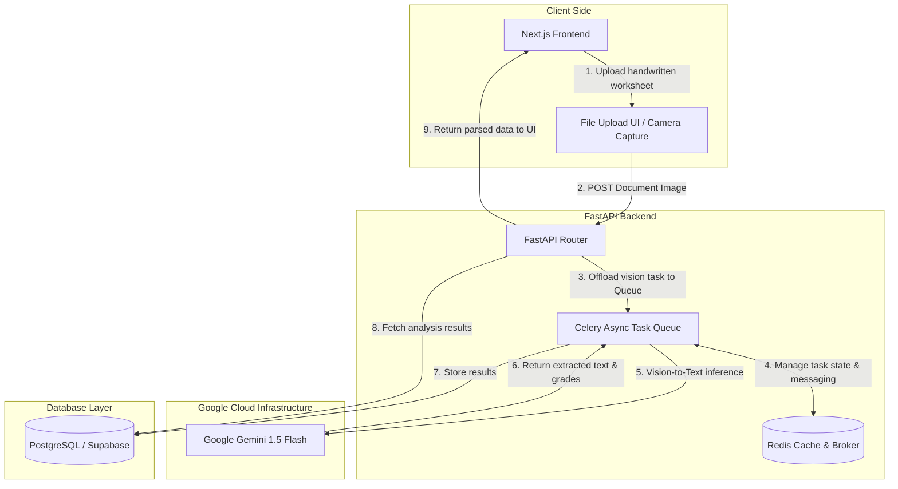

# Kagaz-AI

Kagaz-AI is an advanced full-stack AI platform engineered to bridge physical educational materials and digital analytics. Built for teachers and academic institutions, the system processes uploaded or captured handwritten student worksheets, applies localized optical character recognition (OCR), autonomously evaluates structural math and text answers, detects student pedagogical gaps, and surfaces comprehensive classroom intelligence.

Instead of relying on rigid, resource-heavy legacy OCR pipelines that fail on handwritten documents, Kagaz-AI utilizes an End-to-End Multimodal Vision-to-Text Architecture via **Gemini 1.5 Flash**.

## Table of Contents
- [Key Features](#key-features)
- [System Architecture](#system-architecture)
- [Tech Stack](#tech-stack)
- [Getting Started](#getting-started)
- [Project Structure](#project-structure)

## 🚀 Key Features
- **Multi-Modal Worksheet Ingestion**: Supports direct camera capture compression algorithms or bulk image uploads for handwritten assignments.
- **AI-Powered Evaluation Pipeline**: Eliminates cascading OCR errors and achieves near-human accuracy on unstructured handwriting in a single inference cycle by utilizing an End-to-End Multimodal Vision-to-Text Architecture.
- **Contextual Semantic Correction**: Reads the entire sentence structure at once, using semantic reasoning to accurately guess messy handwriting based on context.
- **Compute Offloading & Asynchronous Architecture**: Leverages Celery backend queues to smoothly process complex image extraction tasks and offload heavy visual computation to Google's specialized TPU infrastructure without stalling client requests.
- **Pedagogical Gap Analysis**: Goes beyond generic pass/fail grading by extracting deeper student learning behaviors, specific error tracking, and macro dashboard analytics for whole classes.
- **Zero-Shot Adaptability**: Handles unstructured document layouts instantly without any extra training data.
- **Offline Resiliency & Multi-Lingual Architecture**: Features local indexing capabilities for unreliable network connectivity environments, along with integrated internationalization translation matrices.

## 🛠️ System Architecture

The application is structured explicitly as a decoupled monorepo split between a high-performance backend analytics worker network and an editorial dashboard interface. Below is the high-level architecture diagram demonstrating how Kagaz AI processes handwritten documents efficiently and asynchronously.



## Tech Stack

### Backend Engine
- **Core Framework**: FastAPI (Python 3.10) for lean, high-throughput asynchronous REST endpoint routing.
- **Task Management**: Celery + Redis for distributed, async processing queues handling long-running image models.
- **Database**: PostgreSQL (Supabase) and SQLAlchemy.
- **AI Core**: Google Gemini 1.5 Flash Vision Model.

### Frontend Client
- **Core Framework**: Next.js (App Router execution) built with clean JavaScript modules, React.
- **Design System**: Tailwind CSS coupled with dynamic, accessible UI blocks (shadcn/ui), Recharts, Lucide React.

## Getting Started

### Prerequisites
- Node.js & npm
- Python 3.10+
- Redis (for the Celery worker queue)
- Google GenAI API Key

### Installation

1. **Clone the repository**
   ```bash
   git clone <repo-url>
   cd "Kagaz AI"
   ```

2. **Backend Setup**
   ```bash
   cd backend
   python -m venv venv
   # On Windows:
   venv\Scripts\activate
   # On macOS/Linux:
   source venv/bin/activate
   
   pip install -r requirements.txt
   ```
   Create a `.env` file in the `backend` directory (use `.env.example` as a template) and add your `GEMINI_API_KEY`, Supabase database URL, and Redis connection string.

3. **Frontend Setup**
   ```bash
   cd frontend
   npm install
   ```
   Create a `.env.local` file in the `frontend` directory for your client-side environment variables.

### Running the Application

For the application to fully work, you need to run the Redis server, the backend API, the Celery worker, and the frontend dev server.

1. **Start Redis Server**
   Ensure your Redis instance is running locally on port `6379`, or configure the remote URL in your `.env`.

2. **Start Backend API Server**
   ```bash
   cd backend
   uvicorn app.main:app --reload
   ```

3. **Start Celery Worker**
   ```bash
   cd backend
   celery -A app.celery_worker worker --loglevel=info
   # On Windows, you might need to use eventlet/gevent or Solo pool:
   celery -A app.celery_worker worker --pool=solo --loglevel=info
   ```

4. **Start Frontend Development Server**
   ```bash
   cd frontend
   npm run dev
   ```

Open [http://localhost:3000](http://localhost:3000) to view the application in your browser.

## Project Structure

- **`/backend`**: Python FastAPI application. It includes routing, database schema configuration (`SQLAlchemy`), and the asynchronous Celery workers to handle Gemini AI integration without blocking HTTP threads.
- **`/frontend`**: Next.js React application. Contains the user interface, file upload forms, and dashboards for displaying the parsed AI results.
