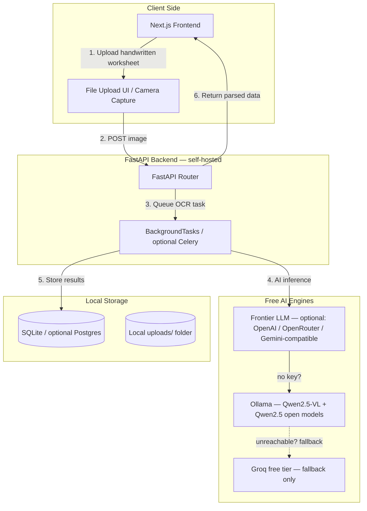

# Kagaz AI

### From student work to the next teaching action.

> **Scan. Understand. Group. Act. Reassess.**

Kagaz AI is a teacher-in-the-loop learning diagnosis and teaching-action assistant for foundational literacy and numeracy. A teacher photographs handwritten student work; Kagaz reads it, maps every response to foundational competencies, detects evidence-based learning gaps (with honest confidence levels), groups students by demonstrated level, recommends a 10-minute remediation using locally available materials, and checks whether learning improved — closing the loop: **ASSESS → UNDERSTAND → GROUP → ACT → REASSESS → REGROUP**.

The engine is deliberately deterministic: pedagogy lives in a structured FLN-aligned framework (competencies, assessment templates, learning tiers, intervention library), not in LLM improvisation. The LLM is used only to read messy handwriting (multimodal OCR) and phrase teacher-friendly feedback. Every AI inference can be confirmed, edited, or flagged as needing more evidence by the teacher.

**100% Free & Open-Source Stack** — no paid APIs, no vendor lock-in:

- **AI Core**: [Gemini](https://aistudio.google.com/apikey) (native, free tier) and/or [Ollama](https://ollama.com) with open-weight models (Qwen2.5-VL vision OCR + Qwen2.5 text grading) — fully local & offline capable
- **Optional tiers**: any OpenAI-compatible API (OpenAI, OpenRouter, …) · Groq free tier as fallback
- **Database**: SQLite (zero config) — PostgreSQL optional
- **Auth**: Local JWT with bcrypt-hashed passwords — no Supabase/Auth0
- **Files**: Local filesystem
- **Everything else**: FastAPI, Next.js, Tailwind, shadcn/ui — all open source

## Table of Contents
- [Key Features](#key-features)
- [System Architecture](#system-architecture)
- [Tech Stack](#tech-stack)
- [Getting Started](#getting-started)
- [Project Structure](#project-structure)

## 🤖 How AI Is Used

Kagaz uses AI at five concrete layers, all routed through one auditable provider (`app/services/ai_provider.py`). The pedagogical core is **deterministic** — an LLM never decides a child's competency level — while AI handles perception, verification, generation, and narration:

| # | Capability | Where | What the model does | Guardrail |
|---|---|---|---|---|
| 1 | **Handwriting OCR** | `services/ocr.py` | Multimodal vision model reads a photo of handwritten work → structured Q&A (question, student answer, correct answer, confidence) | Sandbox-validated image path; answers stored exactly as read — teacher corrects OCR errors in review (human-in-the-loop) |
| 2 | **Semantic pre-grading** | `services/llm.py` | Embedding similarity pre-grades long-form answers (≥ 0.85 → correct) before any LLM call | Exact-match for short/spelling answers; numeric equality is deterministic — `35` vs `53` can never be "semantically similar" |
| 3 | **Blind grading verifier** | `services/llm.py` | "Devil's advocate" verifier judges one answer in isolation to catch phrasing/spelling false-negatives | Runs only when similarity is inconclusive; output validated JSON |
| 4 | **Quick-check generation** | `services/llm.py` | Generates fresh reassessment questions targeted at a group's learning gap — difficulty ramp, class grade, language of instruction | Schema-validated, deduped, capped; **static intervention library is the offline fallback** |
| 5 | **Insight narration** | `services/llm.py` | Turns deterministic evidence into a coaching note (why this group now, 3 misconceptions to watch for, one sentence to say) | **Grounding contract**: the prompt forbids inventing numbers/names; every note carries the facts it may repeat + which model produced it |

**Engine priority chain** (first configured wins, automatic fallback on failure):
`Gemini (native, structured output) → any OpenAI-compatible API → local Ollama → Groq free tier`

Every AI output is tagged with the engine that produced it (`engine` field, shown as a badge in the UI), and `GET /health` reports every engine's configuration and reachability. Offline (no keys, no internet), the app still works end-to-end on local Ollama + rule-based fallbacks.

## 🚀 Key Features
- **Multi-Modal Worksheet Ingestion**: Direct camera capture, client-side compression, or bulk image uploads for handwritten assignments.
- **AI-Powered Evaluation Pipeline**: End-to-end multimodal vision-to-text extraction on open models — no cascading OCR errors, near-human accuracy on unstructured handwriting.
- **Contextual Semantic Correction**: Reads entire sentence structure at once, using semantic reasoning to interpret messy handwriting from context.
- **Semantic Similarity Pre-Grading**: Local open embeddings (`nomic-embed-text`) pre-grade obvious matches before LLM verification.
- **Asynchronous Architecture**: FastAPI BackgroundTasks by default (no Redis needed); optional Celery for scale-out.
- **Pedagogical Gap Analysis**: Beyond pass/fail grading — error tracking, learning-gap taxonomy aligned to NCERT/ASER standards, and classroom analytics.
- **Offline Resiliency**: Local SQLite + local models + heuristic fallback grading keeps the app functional with zero internet.

## 🛠️ System Architecture


```mermaid
graph TD
    subgraph Client [Client Side]
        UI[Next.js Frontend]
        Upload[File Upload UI / Camera Capture]
    end

    subgraph Backend [FastAPI Backend — self-hosted]
        API[FastAPI Router]
        Queue[BackgroundTasks / optional Celery]
    end

    subgraph AI [Free AI Engines]
        Frontier[Frontier LLM — optional: OpenAI / OpenRouter / Gemini-compatible]
        Ollama[Ollama — Qwen2.5-VL + Qwen2.5 open models]
        Groq[Groq free tier — fallback only]
    end

    subgraph DB [Local Storage]
        SQLite[(SQLite / optional Postgres)]
        Files[(Local uploads/ folder)]
    end

    UI -->|1. Upload handwritten worksheet| Upload
    Upload -->|2. POST image| API
    API -->|3. Queue OCR task| Queue
    Queue -->|4. AI inference| Frontier
    Frontier -->|no key?| Ollama
    Ollama -.->|unreachable? fallback| Groq
    Queue -->|5. Store results| SQLite
    API -->|6. Return parsed data| UI
```

## Tech Stack

### Backend Engine
- **Core Framework**: FastAPI (Python 3.11) — asynchronous REST API
- **AI Core**: Ollama (`qwen2.5vl:7b` vision, `qwen2.5:3b` text, `nomic-embed-text` embeddings) with frontier-first priority chain (OpenAI-compatible → Ollama → Groq)
- **Task Management**: FastAPI BackgroundTasks (default) / Celery (optional, SQLite or Redis broker)
- **Database**: SQLite via SQLAlchemy (PostgreSQL optional)
- **Auth**: Local JWT (PyJWT, HS256) + bcrypt password hashing

### Frontend Client
- **Core Framework**: Next.js (App Router) + React
- **Design System**: Tailwind CSS, shadcn/ui, Recharts, Lucide React

## Getting Started

### Option A — Docker (recommended)

```bash
# 1. Start the API + Ollama
docker compose up -d --build

# 2. Pull the free open models (first time only, ~6GB)
docker compose exec ollama ollama pull qwen2.5vl:7b
docker compose exec ollama ollama pull qwen2.5:3b
docker compose exec ollama ollama pull nomic-embed-text

# 3. Frontend
cd frontend && npm install && npm run dev
```

Optional — **recommended**: put a free Gemini key in `.env` (`GEMINI_API_KEY=...` from [aistudio.google.com/apikey](https://aistudio.google.com/apikey)) — native structured-output integration, best OCR quality, works on the free tier. Optional: an OpenAI-compatible key (`OPENAI_API_KEY=...`) and/or a free Groq key (`GROQ_API_KEY=...`) as fallbacks.

Engine priority: **Gemini → OpenAI-compatible → Ollama → Groq** (first configured wins; automatic fallback on failure).

### Option B — Manual local setup

**Prerequisites**: Node.js, Python 3.11+, [Ollama](https://ollama.com)

1. **Install & start Ollama models**
   ```bash
   ollama pull qwen2.5vl:7b
   ollama pull qwen2.5:3b
   ollama pull nomic-embed-text
   ollama serve   # usually already running as a service
   ```

2. **Backend**
   ```bash
   cd backend
   python -m venv venv && source venv/bin/activate   # Windows: venv\Scripts\activate
   pip install -r requirements.txt
   cp .env.example .env   # edit SECRET_KEY: openssl rand -hex 32
   uvicorn app.main:app --reload --port 8000
   ```

3. **Frontend**
   ```bash
   cd frontend
   npm install
   npm run dev
   ```

Open [http://localhost:3000](http://localhost:3000), click **Get Started for Free** — a real local guest account is created for you (no typing). Sign-up/login endpoints (`/api/v1/auth/signup`, `/api/v1/auth/login`) are also available for proper accounts.

## Project Structure

- **`/backend`**: FastAPI application — routing, SQLAlchemy models, background grading pipeline, and the unified `ai_provider` that routes to Ollama (primary) / Groq (fallback).
- **`/frontend`**: Next.js React application — upload forms, review UI, and analytics dashboards.
- **`docker-compose.yml`**: One-command free stack (API + Ollama).
